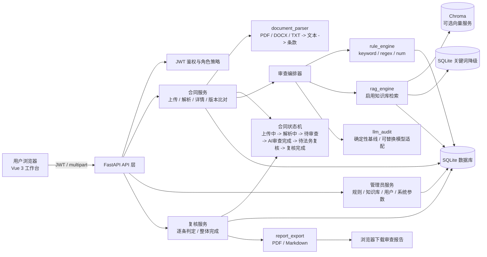
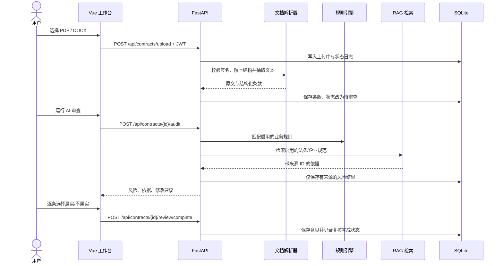
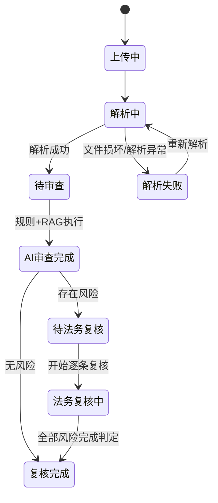

# 架构说明

## 总体架构

系统采用 Vue 3 + FastAPI + SQLite 的轻量化单体架构。RAG、规则引擎、审查器和报告导出均通过后端模块边界隔离，默认可以在没有外部模型和 Chroma 服务的情况下运行本地演示。

## 一次审查时序

## 状态与数据边界

每次状态变更写入 `contract_status_log`，包含合同、状态、操作人和时间。`uploader` 只能查询自己的合同；`legal_reviewer` 可以查看全部合同并执行复核；`admin` 额外拥有 `/api/admin/*` 权限。管理员接口通过 FastAPI 路由依赖统一拦截，不能依赖前端隐藏菜单来保证安全。

## 模块职责

| 模块 | 职责 | 可替换点 |
| --- | --- | --- |
| `backend/main.py` | API、JWT、角色校验、状态编排、静态前端 | 可拆分为多个服务 |
| `backend/document_parser` | PDF/DOCX/TXT 解析、条款抽取 | OCR、版面分析 |
| `backend/rule_engine` | 关键词、正则、数值规则匹配 | Drools、规则平台 |
| `backend/rag_engine` | Chroma 检索与 SQLite 降级 | Milvus、pgvector |
| `backend/llm_audit` | 确定性基线审查、来源门禁、模糊项拦截 | Qwen / OpenAI 兼容服务 |
| `backend/report_export` | PDF、Markdown 报告和免责声明 | 企业模板、对象存储 |
| `frontend/app.js` | 登录、路由、管理台、上传与复核交互 | Vue Router、组件库 |

## 目录与运行边界

- `data_storage/`：SQLite、上传文件和运行时数据，只在本地或挂载卷保存，不提交 Git。
- `knowledge_base/`：首次启动导入的演示规则和知识库 JSON。
- `docs/schema.sql`：与现有单数表名一致的完整建表脚本。
- `docs/demo_seed.sql`：bcrypt 演示账号、规则、知识库和系统参数初始化数据。
- `frontend/assets/contract-review-logo.svg`：导航栏与 favicon 使用的项目 Logo。

默认部署由一个 Uvicorn 进程在 `8082` 提供 API 与前端静态文件；开发脚本额外启动 Vite，默认使用 `5173`，若端口被占用则自动顺延并通过 `--port` 传入实际端口以支持热更新。
